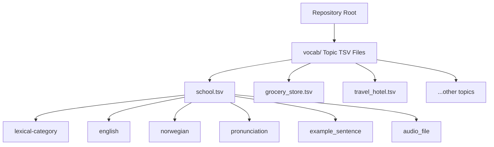

# Norwegian Vocab

A curated collection of Norwegian vocabulary lists organized by real-life contexts. Each file is a TSV with consistent columns for easy filtering and learning.

## Scope and Goal
- This repository focuses on vocabulary commonly encountered in everyday life, not rare or highly specialized terms.
- The goal is to help learners become confident handling day-to-day Norwegian conversations and situations.
- New words should be selected for practical usefulness in typical contexts such as home, school, work, shopping, transport, health, and social interaction.
- Prefer words and expressions with high everyday frequency and immediate communicative value.
- Avoid niche technical jargon, literary/archaic words, and uncommon low-frequency terms unless a topic explicitly requires them.

## What's Inside
- Topic files in `vocab/` (e.g., `vocab/school.tsv`, `vocab/grocery_store.tsv`).
- Each file shares the same schema:
  - `lexical-category` (noun/verb/adjective/adverb/expression)
  - `english`
  - `norwegian`
  - `pronunciation`
  - `example_sentence`
  - `audio_file`

## Quick Peek
Open any TSV in a spreadsheet or editor:

```tsv
lexical-category	english	norwegian	pronunciation	example_sentence	audio_file
noun	school	en skole	/ˈskuːlə/	Jeg går på skole i nærheten.	audio/forvo_no/no_skole_293669_001.mp3
verb	to learn	å lære, lærer, lærte, har lært	/ˈlɛːrə/	Jeg lærer norsk hver dag.	audio/forvo_no/no_l_re_4343434_001.mp3
```

## Structure Overview


