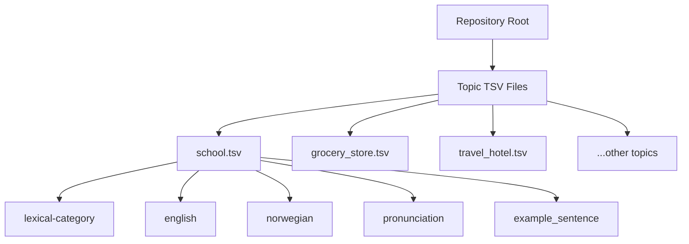

# Norwegian Vocab

A curated collection of Norwegian vocabulary lists organized by real‑life contexts. Each file is a TSV with consistent columns for easy filtering, learning, or importing into flashcard tools.

## What's Inside
- Topic files at the repo root (e.g., `school.tsv`, `grocery_store.tsv`).
- Each file shares the same schema:
  - `lexical-category` (noun/verb/adjective/adverb/expression)
  - `english`
  - `norwegian`
  - `pronunciation`
  - `example_sentence`

## Data Conventions
- **Nouns** include an article: `en/ei/et` (e.g., `en bil`).
- **Verbs** are in four-part form: `å <verb>, present, past, past perfect`.
- **Pronunciation** is provided for the infinitive form only.

## Quick Peek
Open any TSV in a spreadsheet or editor:

```tsv
lexical-category	english	norwegian	pronunciation	example_sentence
noun	school	en skole	/ˈskuːlə/	Jeg går på skole i nærheten.
verb	to learn	å lære, lærer, lærte, har lært	/ˈlɛːrə/	Jeg lærer norsk hver dag.
```

## Structure Overview



## Usage Ideas
- Filter by `lexical-category` to study only verbs or nouns.
- Import TSVs into Anki or other flashcard apps.
- Write small scripts to generate quizzes or frequency stats.

## Contributing
See `AGENTS.md` for repository guidelines and data rules.
